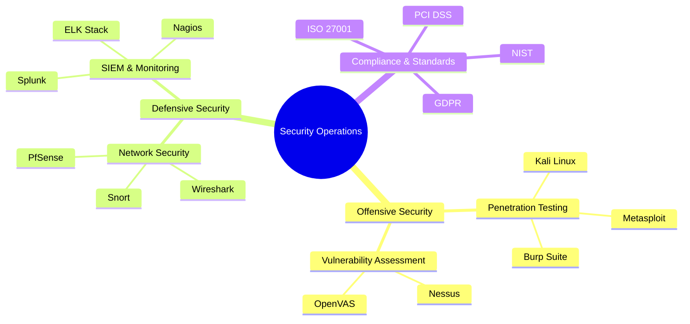

#  ErrorX

<div align="center">
  
  
  

</div>

<div align="center">
  <a href="https://errorx.me">
    
  </a>
  <a href="mailto:info@errorx.me">
    
  </a>
  <a href="https://linkedin.com/in/fakeerrorx">
    
  </a>
  <a href="https://twitter.com/fakeerrorx">
    
  </a>
</div>

<div align="center">
  <h2>
     
    Security Expert 
     
    Tech Enthusiast 
     
    Polyglot
  </h2>
  <h3>
    
    Bengali | English | Hindi | Urdu | Chinese | Arabic
  </h3>
</div>

<br/>

<details open>
<summary><h2>🎯 Areas of Expertise</h2></summary>

<div align="center">
  
  
  | Security| Development| DevOps & Cloud|
  |:---:|:---:|:---:|
  |`Penetration Testing`|`Full-Stack Development`|`Infrastructure as Code`|
  |`Network Security`|`API Development`|`CI/CD Pipelines`|
  |`Threat Analysis`|`Microservices`|`Container Orchestration`|
  |`Security Auditing`|`System Architecture`|`Cloud Architecture`|

</div>
</details>

<details>
<summary><h2>🚀 Technology Arsenal</h2></summary>

<h3 align="center">🔒 Security & Network Architecture</h3>



<h3 align="center">💻 Development & Infrastructure</h3>

<div align="center">

| Frontend| Backend| Database| DevOps|
|:---:|:---:|:---:|:---:|
|||||

</div>
</details>

<details>
<summary><h2>🏆 Achievements & Certifications</h2></summary>

<div align="center">

<table>
<tr>
<td>

```typescript
// Professional Certifications
export const certifications = {
  security: [
    "Certified Ethical Hacker (CEH)",
    "CompTIA Security+",
    "CCNP Security"
  ],
  cloud: [
    "AWS Solutions Architect",
    "Azure Solutions Architect",
    "GCP Professional Cloud Architect"
  ]
};
```

</td>
<td>

```typescript
// Notable Achievements
export const achievements = {
  security: [
    "Bug Bounty Hall of Fame",
    "CTF Competition Champion",
    "Security Research Excellence"
  ],
  development: [
    "DevOps Innovation Award",
    "Open Source Contributor",
    "Tech Conference Speaker"
  ]
};
```

</td>
</tr>
</table>

</div>
</details>

<details>
<summary><h2>📊 GitHub Analytics</h2></summary>

<div align="center">
  
  
  
  

</div>
</details>

<div align="center">
  
</div>

<div align="center">
  
</div>

<!-- 
  Easter Egg: Congratulations on finding this! 
  "In the world of cybersecurity, paranoia is a virtue." - ErrorX
-->
