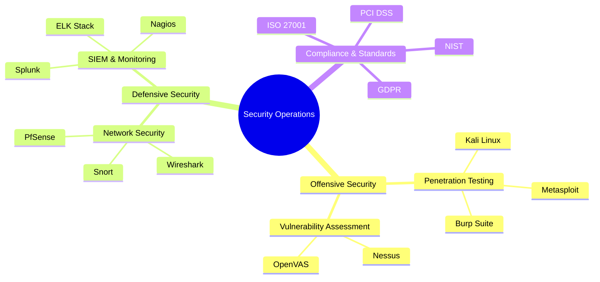

#  ErrorX

  
  
  

  
  
  
  

  <h2>
     
    Security Expert 
     
    Tech Enthusiast 
     
    Polyglot
  </h2>
  <h3>
    
    Bengali | English | Hindi | Urdu | Chinese | Arabic
  </h3>

 

<h2>🎯 Areas of Expertise</h2>

  
  
  | Security| Development| DevOps & Cloud|
  |:---:|:---:|:---:|
  |`Penetration Testing`|`Full-Stack Development`|`Infrastructure as Code`|
  |`Network Security`|`API Development`|`CI/CD Pipelines`|
  |`Threat Analysis`|`Microservices`|`Container Orchestration`|
  |`Security Auditing`|`System Architecture`|`Cloud Architecture`|

<h2>🚀 Technology Arsenal</h2>

<h3 align="center">🔒 Security & Network Architecture</h3>

<h3 align="center">💻 Development & Infrastructure</h3>

| Frontend| Backend| Database| DevOps|
|:---:|:---:|:---:|:---:|
|||||

<h2>🏆 Achievements & Certifications</h2>

<h3>🛡️ Security Certifications</h3>

  
  
  

<h3>☁️ Cloud Certifications</h3>

  
  
  

<h3>🎯 Notable Achievements</h3>

  

     
    <strong style="color: #FF6B6B;">Hall of Fame</strong> 
    Critical Vulnerabilities Found
  

  
  

     
    <strong style="color: #FFD93D;">Competition Winner</strong> 
    Multiple Victories
  

  
  

     
    <strong style="color: #4CAF50;">Security Research</strong> 
    Published Papers
  

  
  

     
    <strong style="color: #6C5CE7;">Innovation Award</strong> 
    Infrastructure Excellence
  

  
  

     
    <strong style="color: #00B0FF;">Major Contributor</strong> 
    Security Tools
  

  
  

     
    <strong style="color: #FF4081;">Tech Conferences</strong> 
    Global Presentations
  

<h2>📊 GitHub Analytics</h2>

  
  
  
  

  

  

<!-- 
  Easter Egg: Congratulations on finding this! 
  "In the world of cybersecurity, paranoia is a virtue." - ErrorX
-->
