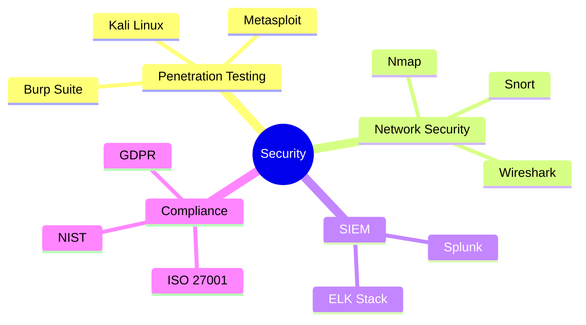

#  ErrorX

<div align="center">
  
  <br/>
  
  

</div>

<div align="center">
  <a href="https://errorx.me">
    
  </a>
  <a href="mailto:info@errorx.me">
    
  </a>
  <a href="https://linkedin.com/in/fakeerrorx">
    
  </a>
  <a href="https://twitter.com/fakeerrorx">
    
  </a>
</div>

<div align="center">
  <h3>🌐 Polyglot Professional | 🛡️ Security Expert | 💻 Tech Enthusiast</h3>
  <h4>🗣️ Bengali | English | Hindi | Urdu | Chinese | Arabic</h4>
</div>

<br/>

<details open>
<summary><h2>🎯 Expertise</h2></summary>

<div align="center">
  
| Cyber Security | Development | DevOps & Cloud |
|:---:|:---:|:---:|
|  |  |  |
| Penetration Testing | Full-Stack | Infrastructure |
| Network Security | API Development | CI/CD |
| Threat Analysis | Microservices | Containerization |
| Security Auditing | System Design | Orchestration |

</div>
</details>

<details>
<summary><h2>🚀 Tech Stack</h2></summary>

<h3>🔒 Security & Network</h3>



<h3>💻 Development</h3>

<div align="center">

| Category | Technologies |
|:--------:|:------------|
| **Frontend** |  |
| **Backend** |  |
| **Database** |  |
| **DevOps** |  |

</div>
</details>

<details>
<summary><h2>🏆 Achievements & Certifications</h2></summary>

<div align="center">

```typescript
const achievements = {
  certifications: [
    "Certified Ethical Hacker (CEH)",
    "CompTIA Security+",
    "AWS Solutions Architect",
    "CCNP Security",
    "Azure Solutions Architect"
  ],
  awards: [
    "Bug Bounty Hall of Fame",
    "CTF Competition Champion",
    "Security Research Excellence",
    "DevOps Innovation Award"
  ]
}
```

</div>
</details>

<details>
<summary><h2>📊 GitHub Analytics</h2></summary>

<div align="center">
  
  
  <p align="center">
     <br/><br/>
  </p>

</div>
</details>

<details>
<summary><h2>🎵 Vibing To</h2></summary>
<div align="center">

[](https://spotify-github-profile.vercel.app/api/view?uid=fakeerrorx)

</div>
</details>

<div align="center">
  
</div>

<div align="center">
  
</div>

<!-- 
  Easter Egg: Congratulations on finding this! 
  "The quieter you become, the more you are able to hear" - Ram Dass
-->
