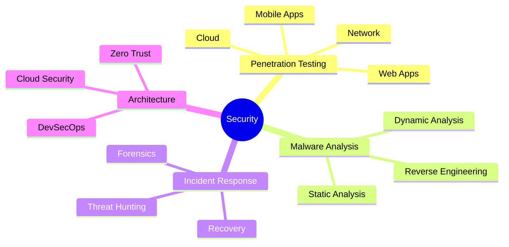

<!-- Header Section -->
<div align="center">
  


[](https://git.io/typing-svg)

<div align="center">
  <a href="https://github.com/fakeerrorx">
    
  </a>
  <a href="https://www.google.com/maps/place/Bangladesh">
    
  </a>
  <a href="#">
    
  </a>
</div>

<div align="center">
  
</div>

<!-- Social Badges -->
<div align="center">
  <a href="https://twitter.com/fakeerrorx">
    
  </a>
  <a href="https://github.com/fakeerrorx">
    
  </a>
  <a href="https://www.youtube.com/c/fakeerrorx">
    
  </a>
</div>

</div>

<!-- Animated Wave -->


##  About Me

<div align="center">
  
  
  ```javascript
  const ErrorX = {
    focus: "Cybersecurity & Development",
    code: ["Python", "JavaScript", "Go", "Rust"],
    tools: {
        security: ["Kali", "Burp Suite", "Metasploit"],
        devOps: ["Docker", "Kubernetes", "AWS"],
        databases: ["MongoDB", "PostgreSQL", "Redis"],
    },
    architecture: ["Microservices", "Event-Driven", "Design Patterns"],
    currentFocus: "Building Secure & Scalable Systems",
    funFact: "I can hack your system while making coffee ☕"
  };
  ```
</div>

<br>

##  Expertise Areas

<div align="center">
  
  <br>
  
</div>

<details>
<summary align="center">🛡️ Click to view detailed expertise</summary>

<h3 align="center">🔒 Security Expertise</h3>



</details>

## 🎯 About Me

> *"In the realm of cybersecurity, innovation is the key to protection, and knowledge is the path to prevention."*

I'm a passionate Cybersecurity Expert and Full-Stack Developer from Bangladesh, dedicated to making the digital world more secure. With expertise spanning cybersecurity, full-stack development, DevOps, and network security, I bring a comprehensive approach to digital security and development.

<div align="center">
   <br><br>
</div>

## 🔥 Expertise Areas

<table align="center" border="none">
  <tr>
    <td width="33%" align="center">
      
      <h3>🛡️ Cybersecurity</h3>
      <p align="left">
        ◆ Penetration Testing<br>
        ◆ Vulnerability Assessment<br>
        ◆ Incident Response<br>
        ◆ Malware Analysis<br>
        ◆ Security Architecture<br>
        ◆ Threat Intelligence<br>
        ◆ Digital Forensics<br>
        ◆ Zero-Day Research
      </p>
    </td>
    <td width="33%" align="center">
      
      <h3>🌐 Full-Stack Development</h3>
      <p align="left">
        ◆ Web Applications<br>
        ◆ Mobile Development<br>
        ◆ API Development<br>
        ◆ Database Design<br>
        ◆ Cloud Architecture<br>
        ◆ Microservices<br>
        ◆ UI/UX Design<br>
        ◆ System Architecture
      </p>
    </td>
    <td width="33%" align="center">
      
      <h3>🚀 DevOps & Cloud</h3>
<p align="left">
        ◆ Container Orchestration<br>
        ◆ CI/CD Pipelines<br>
        ◆ Infrastructure as Code<br>
        ◆ Performance Optimization<br>
        ◆ Log Management<br>
        ◆ Traffic Management<br>
        ◆ Automation<br>
        ◆ Security Integration
      </p>
    </td>
  </tr>
</table>

## 🚀 Tech Stack

### 🔒 Security Tools & Technologies


### 💻 Programming Languages


### 🎨 Frontend Development


### ⚙️ Backend Development


### 🛢️ Databases & Storage


### 🔧 Development Tools


### 🌐 Cloud Platforms & Services


### 🔄 Version Control & CI/CD


### 🐳 Containerization & Orchestration


### 🔍 Code Quality & Analysis


### 📱 Mobile App Security


### 🔐 Cryptography & PKI


### 🛡️ Network Security & Monitoring


### 🤖 Security Automation


## 🏆 Certifications & Achievements

<div align="center">
  <table>
    <tr>
      <td align="center">
        
        <br>CEH
      </td>
      <td align="center">
        
        <br>OSCP
      </td>
      <td align="center">
        
        <br>CISSP
      </td>
      <td align="center">
        
        <br>AWS Security
      </td>
    </tr>
    <tr>
      <td align="center">
        
        <br>GSEC
      </td>
      <td align="center">
        
        <br>GPEN
      </td>
      <td align="center">
        
        <br>Security+
      </td>
      <td align="center">
        
        <br>Network+
      </td>
    </tr>
    <tr>
      <td align="center">
        
        <br>Azure Security
      </td>
      <td align="center">
        
        <br>GCP Security
      </td>
      <td align="center">
        
        <br>CISM
      </td>
      <td align="center">
        
        <br>CCSP
      </td>
    </tr>
    <tr>
      <td align="center">
        
        <br>eWPT
      </td>
      <td align="center">
        
        <br>eCPPT
      </td>
      <td align="center">
        
        <br>CRTP
      </td>
      <td align="center">
        
        <br>CRTE
      </td>
    </tr>
  </table>
</div>

##  GitHub Analytics

<p align="center">
  <a href="#">
    
    
  </a>
</p>

<p align="center">
  
</p>

<div align="center">
  
</div>

##  Connect with Me

<div align="center">
  <a href="mailto:info@errorx.me">
    
  </a>
  <a href="https://twitter.com/fakeerrorx">
    
  </a>
  <a href="https://www.linkedin.com/in/fakeerrorx">
    
  </a>
  <a href="https://discord.gg/fakeerrorx">
    
  </a>
</div>


<div align="center">
  
  <br>
  
</div>
